# Bcalc Firearm Management App

## Readme Contents

1. What is this?
2. Who is this for?
3. Installation Guide
4. User Guide
5. Credits & License

---

## 1. What is this?

The Bcalc Firearm Management App is an open-source firearm, optics, and ammunition tracker with no cloud-based services or subscriptions.

You can enter multiple configurations of firearms, optics, and ammunition. For each configuration, you can track range session performance and conditions. Data reports such as rounds per firearm and top configurations by caliber are available.

An internet connection is not required once installed. No user data is transmitted.

## 2. Who is this for?

Hunters and hobbyists who prefer open-source applications. It's easy to track your firearm performance with different ammunition, whether purchased or hand-load.

## 3. Installation Guide

### 1. Linux (standalone application - no python installation required)

- download "bcalctracker" from the https://github.com/briancalc/bcalctracker/releases page
- to run using file manager, double click bcalctracker
- to run from the terminal ./bcalctracker

### 2. Windows

- in progress

### 3. Mac

- in progress

## 4. User Guide

**Step 1:** Create a password to secure your records

Don't misplace your password as there is no recovery option.

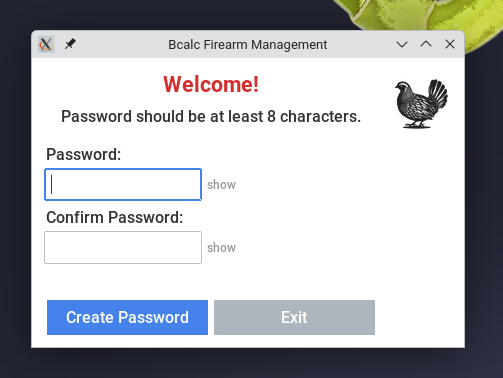

**Step 2: Firearms**

Configurations are what facilitate the collection of range session data. Configurations can consist of a firearm, an optic, and a specific ammunition or, at the minimum, just a firearm.

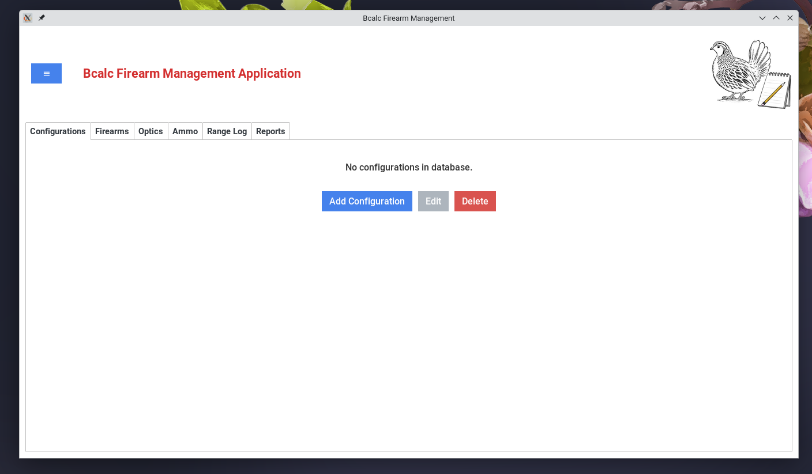

So, you need to enter a firearm: click on the Firearms tab and select the blue Add Firearm button. Firearm Name, Caliber Primary, and Barrel Length are required fields. Enter as many of the other fields as you would like, including attaching a photo. You can always return and edit the information later.

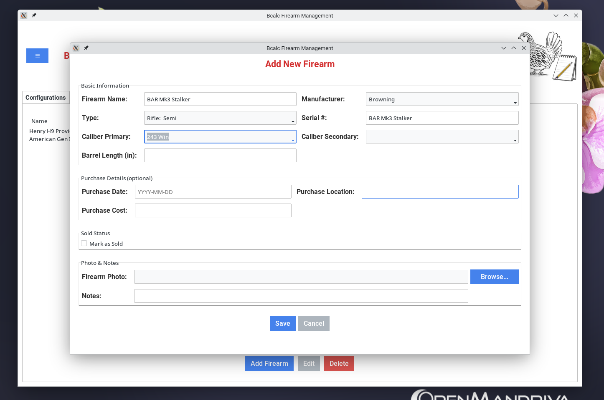

**Step 3: Optics**

Next, you can enter an optic. Select the Optic Tab and then the Add Optics button.

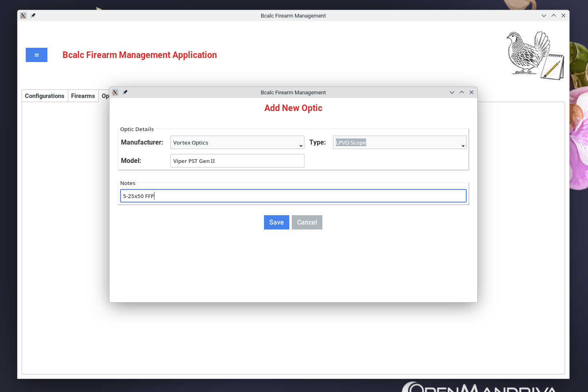

**Step 4: Ammunition**

You guessed it. Enter ammunition by selecting the Ammo Tab and then the Add Ammo button. Both purchased and hand-load ammunition can be tracked.

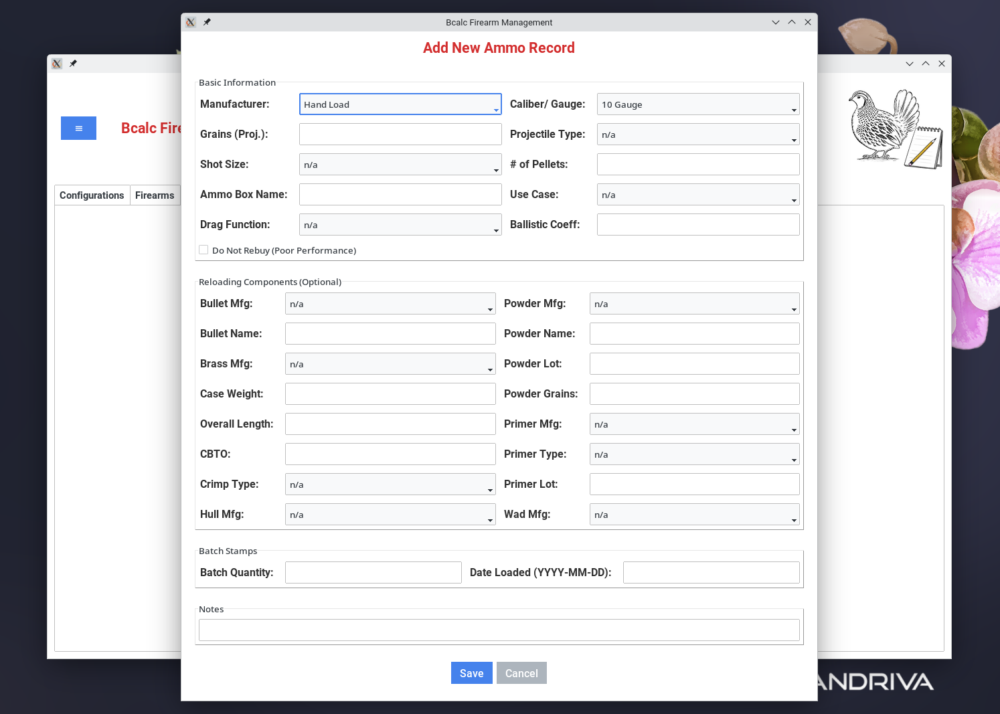

**Step 5: Configurations**

Enter a configuration by selecting the Configuration Tab and then the Add Configuration button. At a minimum, a configuration must include a firearm. There are no practical limits to the number of different configurations of firearms, optics, and ammunition. It is very likely that each firearm will have several ammo brands associated with it.

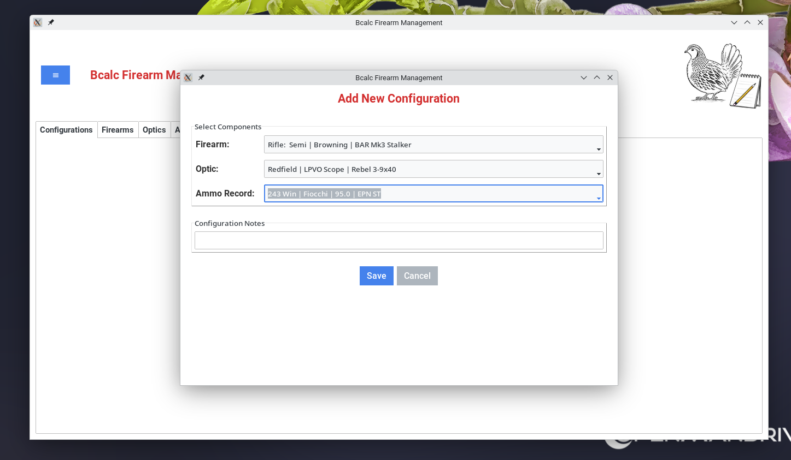

**Step 6: Range Log**

Select the Range Log Tab and the add Session button. Configurations are the primary key for the range results. All other data is optional. A Rating field is provided to help track the firearm-ammo performance.

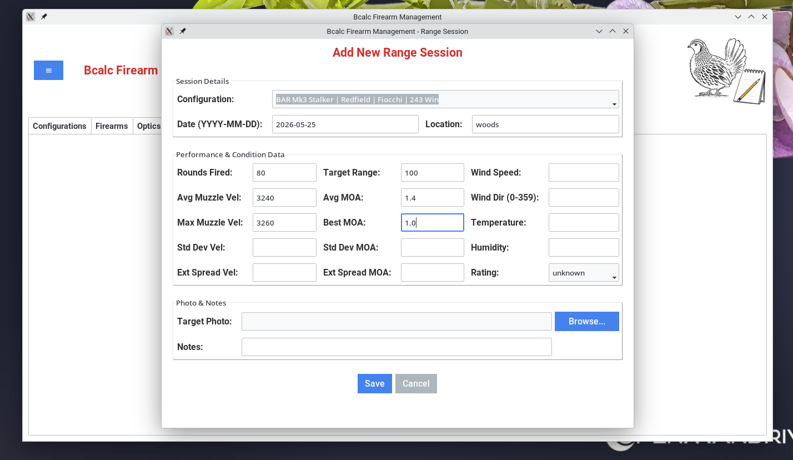

**Step 7: Reports**

Select the Reports Tab. Several data points are shown including total rounds per firearm and the top configurations per caliber calculated using MOA and Std Dev MOA data.

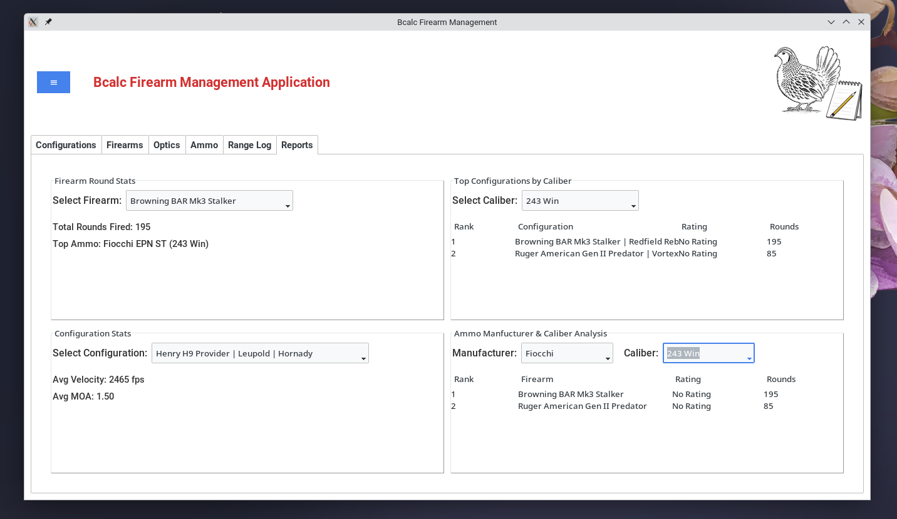

**Step 8: Backup and Restore**

It's a good idea to periodically save a copy of the database just in case. Click the blue hamburger menu at the top left of the window and select Backup Database.

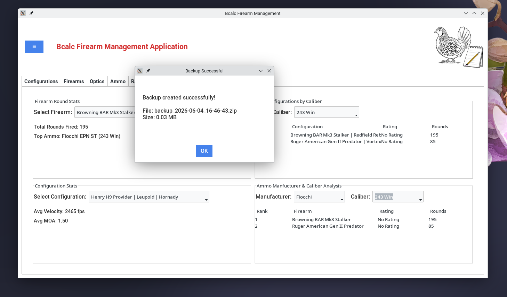

To restore your records from a backup, click the blue hamburger menu and select Restore Database. Pick a backup and press Restore.

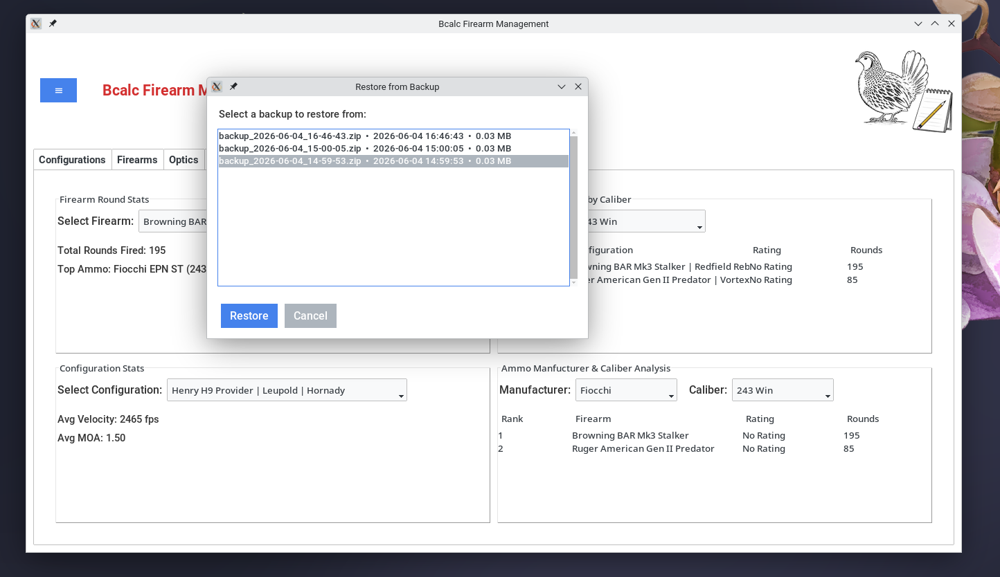

Your current database will be replaced by the backup so be certain you want to restore your previous records.

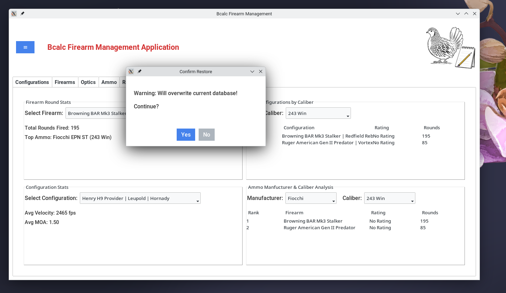

## 5. Credits & License

The Bcalc Firearm Management App was created by Brian Calc.

GNU General Public License (GPL) Version 3.

